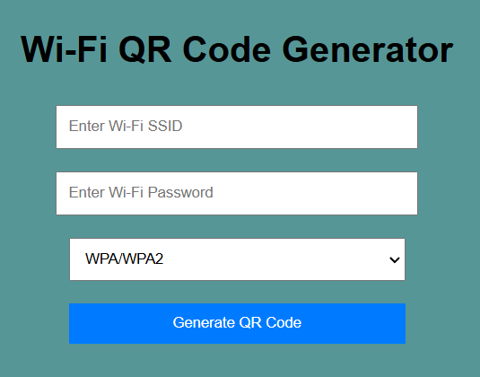
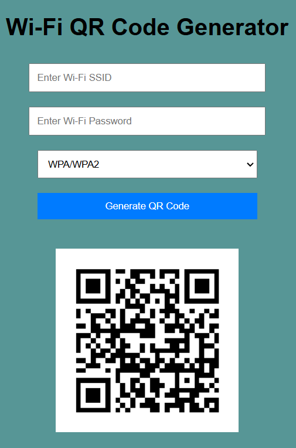

<p align="center">
    
</p>
    <b>QR Portal</b> is a streamlined web tool for generating Wi-Fi QR codes.<br>
    Instantly create a QR code for your network and connect devices with a simple scan.
</p>

---

## Features
- Input Wi-Fi credentials (SSID, password, encryption type)
- Instant QR code generation
- Responsive design for all devices
- User-friendly interface

---

## How to Use
1. Open the QR Portal webpage.
2. Enter your Wi-Fi network name (SSID) and password.
3. Choose the encryption type (WPA/WPA2, WEP, or None).
4. Click **Generate QR Code**.
5. Scan the QR code with your smartphone to connect.

---

## Setup
### Local Usage
1. Clone the repository:
2. Go to the project folder:

```
git clone https://github.com/gurraoptimus/qr-portal.git
```

```
cd qr-portal
```

3. Open `index.html` in your browser.

### Online Sharing
- Share the live link with users.

---

## Built With
- **HTML5**: Structure
- **CSS3**: Styling & responsiveness
- **JavaScript**: QR code logic
- [qrcode.js](https://github.com/soldair/node-qrcode): QR code generation library

<p align="center">
    <br>
    <a href="https://gurraoptimus.github.io/QR-Portal/">Try the live version: QR Portal</a><br>
    Download the Android app:<br>
    <a href="https://github.com/gurraoptimus/QR-Portal/releases">
        
    </a>
    <a href="https://github.com/gurraoptimus/QR-Portal/tags">
        
    </a><br>
    <code>If you can't install the app, disable security & blockers.</code>
</p>

---

## Screenshots
<p align="center">
    <br><br>
    
</p>

---

## Contributing
Contributions are welcome!
1. Fork the repo.
2. Create a branch:
        ```bash
        git checkout -b feature-name
        ```
3. Commit your changes:
        ```bash
        git commit -m "Describe your changes"
        ```
4. Push your branch:
        ```bash
        git push origin feature-name
        ```
5. Open a pull request.

---

## Contact
Questions or feedback? Reach out:
- **Developer**: Gurraoptimus
- **Email**: support@gurraoptimus.se
- **GitHub**: [Source code](https://github.dev/gurraoptimus/QR-Portal)

## License
Licensed under the MIT License. See the `LICENSE` file for details.

---